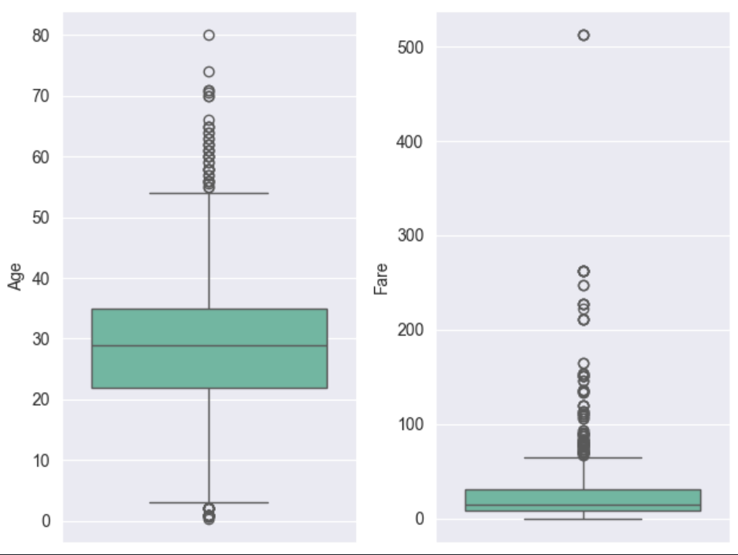
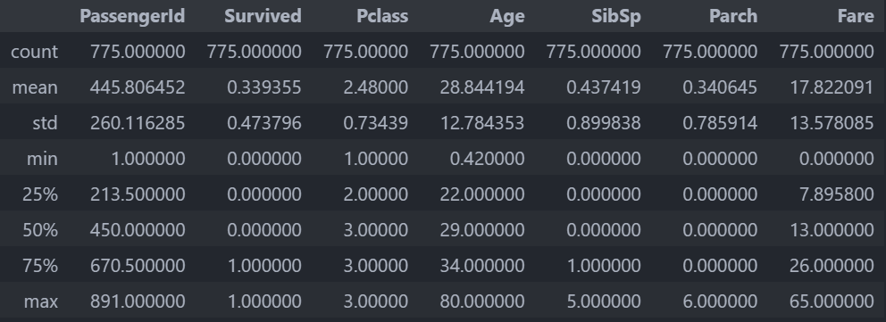
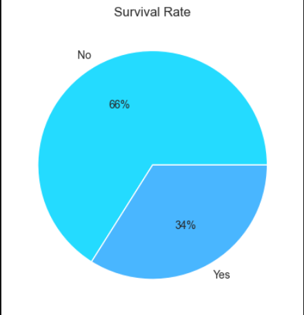
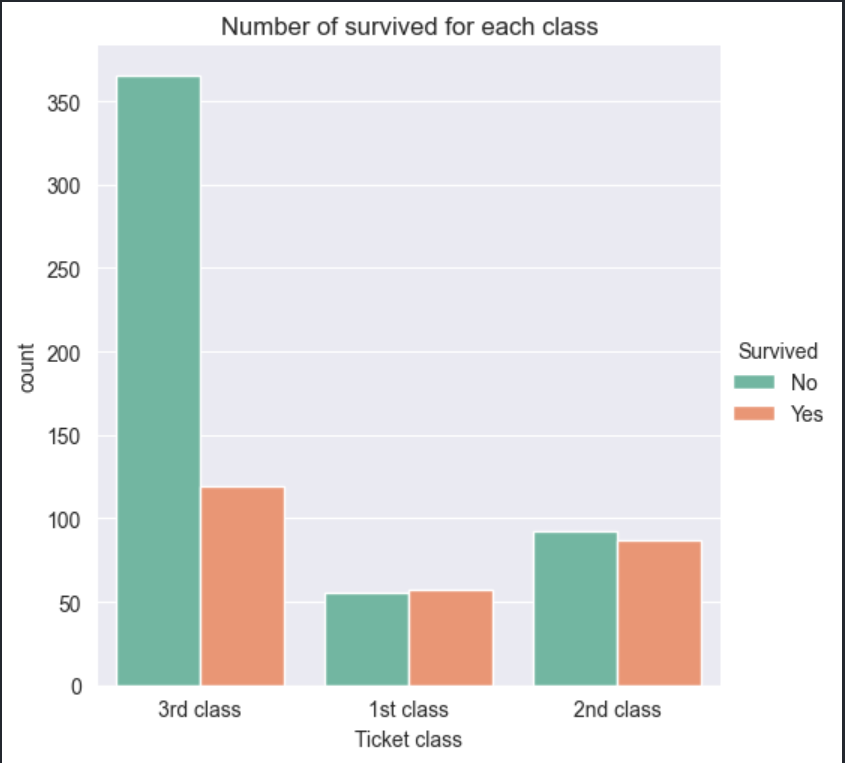
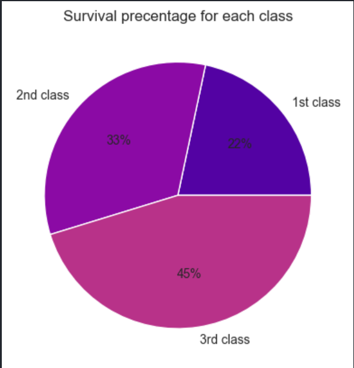
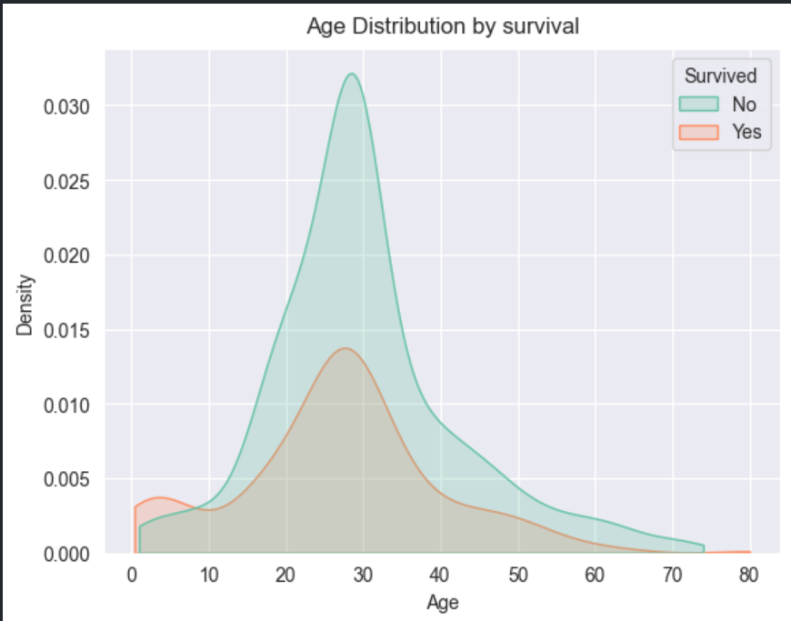
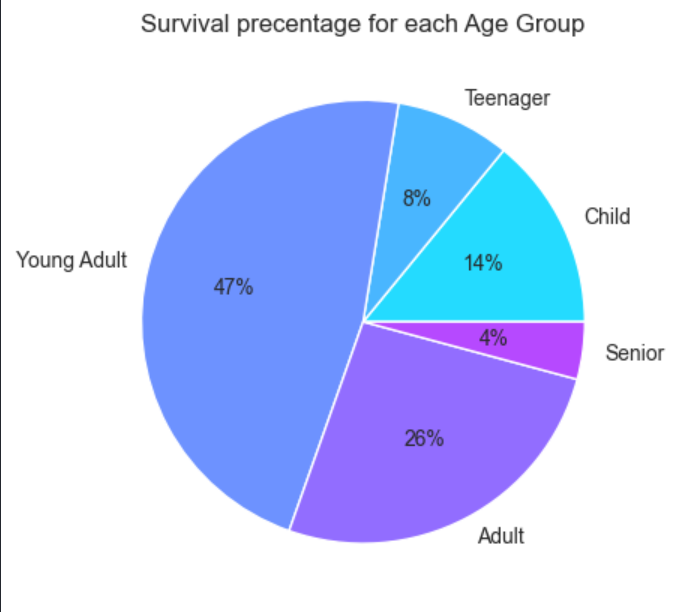
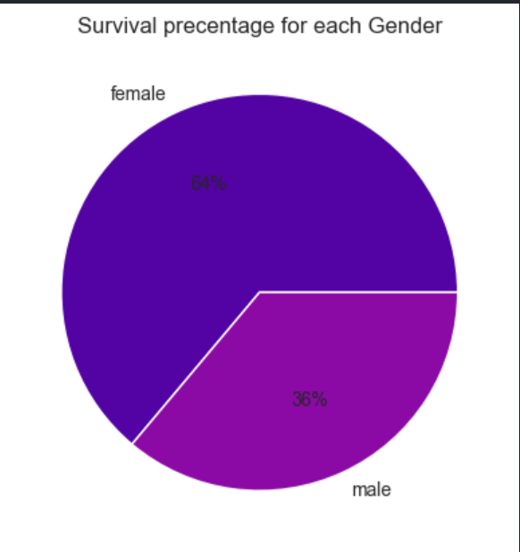
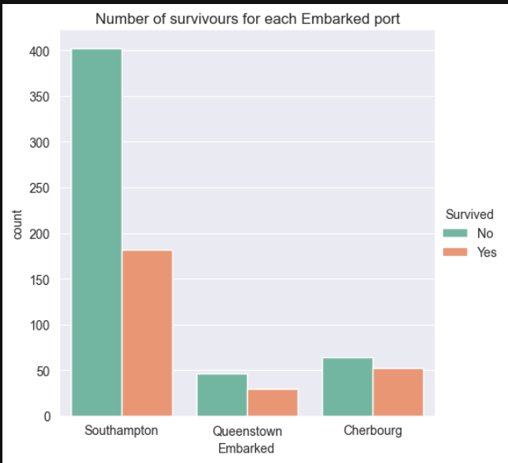
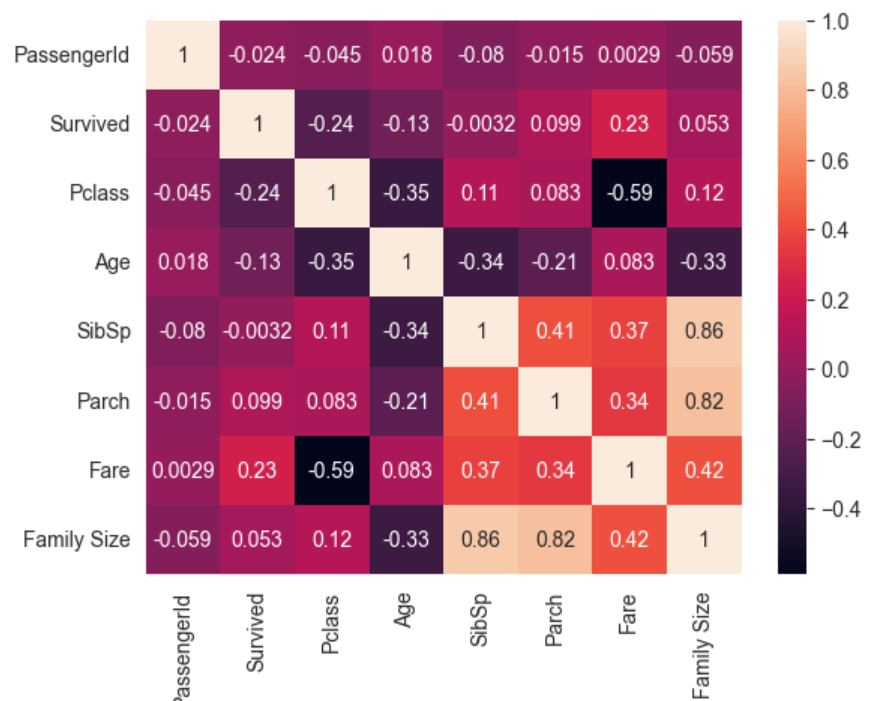

# Titanic Dataset EDA

## 1. Introduction
This analysis explores the Titanic dataset using exploratory data analysis (EDA) techniques to uncover patterns and insights. The focus is on understanding passenger demographics, survival rates, and relationships among features.

## 2. Data Overview
The dataset contains information about Titanic passengers, including their demographic details, ticket class, and survival status. 

### Summary of the Dataset
- **Total rows**: Number of passengers in the dataset.
- **Missing values**: Several features like `Age` and `Cabin` had missing values, which were addressed during preprocessing.
- **Key features**: 
  - `Survived`: Target variable indicating survival (1 = Survived, 0 = Did not survive).
  - `Pclass`: Passenger class (1st, 2nd, or 3rd).
  - `Age` : Age in years
  - `sibsp`: 	# of siblings / spouses aboard the Titanic
  - `parch`: # of parents / children aboard the Titanic
  - `ticket`: Ticket number
  - `fare`: Passenger fare
  - `cabin`: Cabin number
  - `embarked`: Port of Embarkation     C = Cherbourg, Q = Queenstown, S = Southampton

## 3. Missing Values Analysis
A significant portion of the `Cabin` feature had missing values, which led to its exclusion from the analysis. The `Age` feature was imputed with its median value for each gender, and missing `Embarked` entries were removed because its less than 5% from data.
``` python
->  {'female': 27.0, 'male': 29.0}
```

The `Cabin` imputed with the mode of each `Pclass`
``` python
->  {1: 'C23 C25 C27', 2: 'F33', 3: 'G6'}
```

## 4. Outlier Analysis

- Here wh have alot of outlier in fare so we removed it with IQR.

The description of the data after cleaning it.


## 5. Feature Engineering
- We extract here 2 new features {`Age Group`,`Family size`}
- for `Age group`:
  - Age 0->12: Child
  - Age 13->18: Teenager
  - Age 19->30: Young Adult
  - Age 31->50: Adult
  - Age 51->80: Senior
- for `Family size` = `Sibsp` + `Parch` + 1

## 6. Exploratory Data Analysis

### Survival Rate
The analysis revealed that approximately 34% of passengers survived the disaster. A Pie chart showed the precentage of survivors and non-survivors.




### Passenger Class
Survival rates varied significantly across passenger classes:
- **1st Class**: Lower survival rate.
- **3rd Class**: Higher survival rate.

A grouped bar chart compared survival counts within each class.




### Age Distribution
The age distribution highlighted that passengers ranged from infants to the elderly. Younger passengers (Young Adult) had a higher likelihood of survival.



Pie Chart depicted survival rates across different age groups.



### Gender Analysis
The analysis confirmed that females had a significantly higher survival rate compared to males.



### Embarkation Port
Passengers who embarked from different ports had varying survival rates. Those from Southampton (S) had the highest survival rate.



## 5. Correlation Analysis
A heatmap of feature correlations revealed relationships between variables.



## 6. Insights and Observations
- **Survival Rate**: Around 34% of passengers survived.
- **Passenger Class**: Third-class passengers had a significantly higher survival rate compared to second and First-class passengers.
- **Gender**: Females had a much higher survival rate than males.
- **Age**: Young Adult (younger passengers) were more likely to survive.
- **Embarked**: Passengers who embarked from port S (Southampton) had the highest survival rate.

## 7. Conclusion
This EDA reveals key factors influencing survival on the Titanic. Features like passenger class, gender, and age play a critical role. These insights could guide predictive modeling and further analysis.
